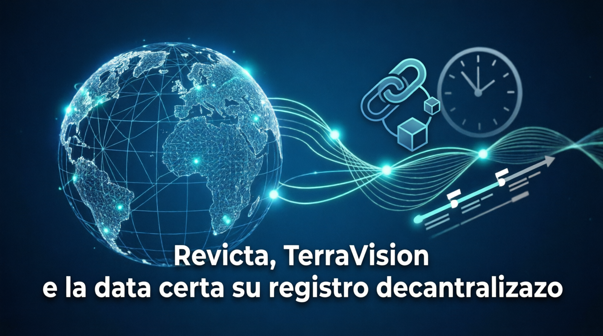

# New Intermedia AI Blog

Blog ufficiale di **New Intermedia AI** - Analisi e approfondimenti su intelligenza artificiale, tecnologia, diritto e innovazione digitale.


## 📚 Contenuti

Il blog tratta temi all'intersezione tra tecnologia e diritto:

- **Intelligenza Artificiale** - Impatto sul lavoro, etica, regolamentazione
- **Blockchain e registri decentralizzati** - Certificazioni, proprietà digitale, smart contract
- **Diritto digitale** - Privacy, proprietà intellettuale, responsabilità
- **Innovazione tecnologica** - Trend, analisi, casi studio

## 📝 Articolo in Evidenza

### Revicta e il caso TerraVision vs Google Earth
*Come la data certa su registro decentralizzato avrebbe cambiato la storia*



La vicenda tra TerraVision e Google Earth è uno degli esempi più emblematici di controversia sulla paternità di un'innovazione digitale. In questo contesto, un sistema come Revicta – basato sulla certificazione di "data certa" su registro pubblico decentralizzato e distribuito – mostra chiaramente quanto la prova tecnica temporale possa fare la differenza.

#### Una brevissima storia di TerraVision

TerraVision nasce nei primi anni '90 grazie alla società tedesca ART+COM: era un sistema di visualizzazione 3D del globo che combinava immagini satellitari, riprese aeree e dati altimetrici, permettendo di "volare" virtualmente sulla Terra con una fluidità sorprendente per l'epoca. Anni dopo, Google presenta Google Earth, un software che agli occhi di molti – e, in parte, anche della narrazione mediatica – appare concettualmente molto simile alle idee alla base di TerraVision.

Nel 2014 ART+COM intenta causa negli Stati Uniti, sostenendo che Google Earth violi un brevetto depositato nel 1995 relativo al loro sistema. Nel 2016, una giuria federale si pronuncia a favore di Google e nel 2017 la Corte d'Appello conferma che il brevetto di ART+COM non è valido, anche perché esistevano già sistemi di visualizzazione geografica 3D considerati "prior art", anteriori a quel brevetto.

#### Cosa fa Revicta: data certa su registro decentralizzato

Revicta è un servizio di notarizzazione digitale che permette di associare a un documento una data certa, registrandone l'impronta (hash) su un registro pubblico decentralizzato, in conformità con il quadro normativo italiano (art. 8-ter L. 12/2019) ed europeo (regolamento eIDAS).

In pratica, si calcola l'hash di un file – ad esempio un PDF con specifiche funzionali, un documento di progetto, una serie di diagrammi di architettura o addirittura uno snapshot di codice sorgente – e si registra questa impronta sul registro, ottenendo una prova tecnicamente verificabile che quel contenuto esisteva in una certa forma a una certa data.

Il dato interessante è che non è necessario rendere pubblico il contenuto del documento: ciò che viene pubblicato è solo la sua impronta crittografica, che consente, in caso di contenzioso, di dimostrare che un determinato file (non modificato) era già presente in una certa data.

#### Come Revicta avrebbe aiutato TerraVision

Nel caso TerraVision vs Google Earth, una delle questioni centrali era stabilire chi avesse effettivamente sviluppato per primo determinate soluzioni tecniche e in che misura fossero davvero originali rispetto a ciò che già esisteva. Se all'epoca fosse stato disponibile, e soprattutto utilizzato, un sistema come Revicta, ART+COM avrebbe potuto:

- **Ancorare periodicamente** specifiche tecniche, prototipi, demo interne, diagrammi di sistema e documenti di progettazione sul registro pubblico decentralizzato, creando una vera e propria timeline tecnica dell'evoluzione di TerraVision.

- **Presentare in giudizio**, accanto al brevetto, una sequenza di prove digitali con data certa che attestano l'esistenza di precise funzionalità, architetture e idee progettuali in momenti ben definiti, rendendo molto più difficile contestare la priorità temporale del loro lavoro.

Questo non avrebbe eliminato il problema dell'"arte pregressa" (cioè dei sistemi anteriori che la Corte ha ritenuto rilevanti), ma avrebbe reso più robusta la prova dell'evoluzione interna del progetto TerraVision e della continuità del suo sviluppo.

#### Mettere anche Google di fronte alle proprie date

Un punto spesso trascurato è che un registro pubblico decentralizzato non è uno strumento "di parte". Se una realtà come ART+COM avesse documentato in questo modo il proprio percorso, la controparte avrebbe dovuto fare altrettanto per sostenere la tesi dello sviluppo indipendente.

In altre parole, Revicta non avrebbe solo rafforzato la posizione di TerraVision, ma avrebbe:

- **Costretto Google** a mostrare una cronologia tecnica altrettanto dettagliata: versioni interne, specifiche, prove di concetto e prototipi certificati nel tempo, per dimostrare che lo sviluppo di Google Earth era autonomo, parallelo ma non dipendente da conoscenze riservate di ART+COM.

- **Ridotto lo spazio** per ricostruzioni ex post basate su memorie, testimonianze o documenti informali, spostando il baricentro del contenzioso su evidenze tecniche forti e verificabili da terzi.

Questo crea una "simmetria probatoria": entrambe le parti sono incentivate a costruire nel tempo una storia digitale verificabile della propria attività di ricerca e sviluppo, sapendo che, in caso di controversia, saranno chiamate a confrontare queste timeline davanti a giudici e periti tecnici.

#### Un nuovo modo di raccontare l'innovazione

Se un sistema come Revicta fosse stato disponibile e adottato all'epoca di TerraVision, oggi non avremmo solo un brevetto del 1995 e una serie di testimonianze sulla genesi del progetto, ma una traccia precisa e resistente al tempo delle tappe chiave della sua evoluzione.

In casi come questo, Revicta diventa un "registro storico digitale" dell'innovazione:

- **Ogni documento rilevante** – dal primo mockup fino alle versioni più mature del software – può essere certificato con data certa, creando una timeline tecnica che integra e rafforza i tradizionali strumenti giuridici (brevetti, contratti, NDA).

- **In eventuali contenziosi futuri**, giudici e periti non devono affidarsi solo a dichiarazioni e ricostruzioni a posteriori, ma possono lavorare su una base di prove digitali cronologicamente solide, accessibili e difficilmente manipolabili.

> **Revicta non garantisce da sola l'esito di una causa**, né sostituisce il ruolo della giurisprudenza in materia di brevetti e proprietà intellettuale. Ma rende più chiara, trasparente e verificabile la storia tecnica delle idee, mettendo innovatori e grandi player tecnologici di fronte a un nuovo standard di responsabilità: se un'idea è davvero tua, puoi dimostrarlo nel tempo, con prove forti e imparziali registrate su un'infrastruttura che non dipende da nessuna delle parti coinvolte.

---

## 🛠️ Tecnologie

- **[Jekyll](https://jekyllrb.com/)** - Generatore di siti statici
- **[GitHub Pages](https://pages.github.com/)** - Hosting gratuito
- **Tema**: Minima (personalizzato)

## 🚀 Setup Locale

Per testare il blog in locale:

```bash
# Clone del repository
git clone https://github.com/newintermediai/newintermediaai.github.io-blog.git
cd newintermediaai.github.io-blog

# Installa le dipendenze
bundle install

# Avvia il server di sviluppo
bundle exec jekyll serve
```

Il blog sarà disponibile su `http://localhost:4000/blog/`

## 📁 Struttura del Progetto

```
├── _config.yml              # Configurazione Jekyll
├── _posts/                  # Articoli del blog
│   └── 2026-07-22-revicta-terravision.md
├── _layouts/                # Layout HTML
│   ├── default.html
│   ├── post.html
│   └── page.html
├── assets/
│   ├── css/style.css        # Stili personalizzati
│   └── images/              # Immagini
├── index.md                 # Pagina principale
├── about.md                 # Pagina "Chi Siamo"
└── 404.md                   # Pagina errore
```

## ✍️ Come Pubblicare un Nuovo Articolo

1. Crea un nuovo file in `_posts/` con il formato: `YYYY-MM-DD-titolo-articolo.md`
2. Aggiungi il front matter YAML:

```yaml
---
layout: post
title: "Titolo dell'articolo"
subtitle: "Sottotitolo opzionale"
date: YYYY-MM-DD
author: "New Intermedia AI"
image: /assets/images/immagine.png
categories: [categoria1, categoria2]
tags: [tag1, tag2, tag3]
---

Contenuto dell'articolo in Markdown...
```

3. Carica l'immagine in `assets/images/`
4. Commit e push su GitHub

## 📄 Licenza

© 2026 New Intermedia AI. Tutti i diritti riservati.

